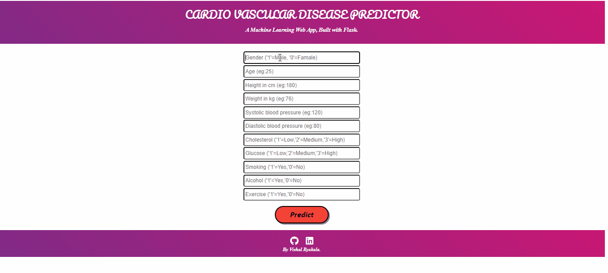

# CardioVascularDiseasePrediction-IneuronMLChallenge

• This repository consists of files required to deploy a Machine Learning Web App created with Flask on Heroku platform.

• This project predicts whether a person is suffering from Cardio Vascular Disease or not by taking certain inputs related to their health, body and lifestyle.

• If you want to view the deployed model, click on the following link:
Deployed at: https://cardiovasculardiseasepredictor.herokuapp.com/

A glimpse of the app is below:-

#Special Note:- Thanks to Anuj Vyas for the css template.
